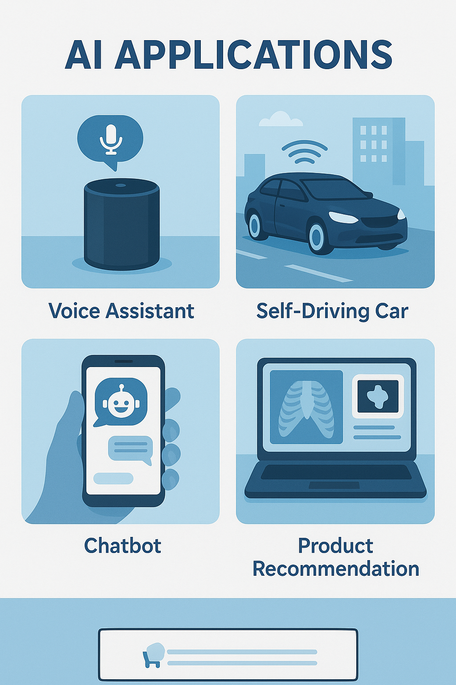

Table of Contents

**Chapter** **1.** **Introduction** **to** **Artificial**
**Intelligence** **2**

**Chapter** **2.** **AI** **Technologies** **and** **the** **ML**
**Model** **36**

**Chapter** **3.** **Machine** **Intelligence** **&** **Problem**
**Solving** **47**

**Chapter** **4.** **Search** **Algorithms** **66**

**Chapter** **5.** **Machine** **Learning** **Fundamentals** **78**

**Chapter** **6.** **Neural** **Networks** **and** **Deep** **Learning**
**103**

**Chapter** **7.** **Modern** **Sequence** **Models** **and**
**Transformers** **113**

**Chapter** **8.** **Knowledge** **Representation** **and** **Agents**
**131**

**Chapter** **9.** **Prompt** **Engineering** **Foundations** **153**

**Chapter** **10.** **Prompt** **Engineering** **Techniques** **for**
**ChatGPT** **173**

**Chapter** **11.** **Trends** **in** **AI** **188**

**Chapter** **12.** **Ethics,** **Control,** **and** **Alignment**
**210**

**Chapter** **13.** **AI** **as** **a** **Service** **(AIaaS)** **223**

**Chapter** **14.** **Artificial** **Intelligence** **of** **Things**
**(AIoT)** **232**

**Chapter** **15.** **Robotics** **and** **Autonomous** **Systems**
**242**

**Chapter** **16.** **No-Code** **and** **Low-Code** **AI** **267**

**Chapter** **17.** **Applications** **of** **AI** **—** **Computing**
**&** **Electronics** **176**

**Chapter** **18.** **Applications** **of** **AI** **—**
**Engineering,** **Life** **Sciences** **&** **Industry** **288**

**Chapter** **19.** **The** **Future** **of** **AI** **—** **Industry,**
**Research,** **and** **Governance** **301**

> 1

Chapter 1. Introduction to Artificial Intelligence

Introduction

Artificial Intelligence (AI) is no longer confined to research labs or
futuristic speculation. It has become a pervasive reality that
influences economies, industries, and societies across the globe. For
students of engineering, understanding the “big picture” of AI is just
as important as mastering its algorithms and architectures. This chapter
provides an overview of AI’s scope and definitions, its
multidisciplinary roots, and its impact on industries, the economy, and
society. By the end of the chapter, students will have a clear framework
for appreciating AI not only as a technological advancement but also as
a transformative force that shapes the way humans interact with machines
and each other.

1.1 What is Artificial Intelligence?

**Artificial** **Intelligence** **(AI)** is a branch of computer science
that focuses on designing systems capable of performing tasks that
typically require human intelligence. These tasks include reasoning,
learning from data, solving problems, understanding language,
recognizing patterns, and making decisions.

The main objective of AI is to develop machines and software that can
**simulate** **human** **thinking** **and** **behavior**, enabling them
to interact with the environment, process information, and take actions
that help achieve specific goals.

> 2

> Fig1.1: AI Applications

**Key** **Characteristics** **of** **AI** **Systems**

> ● **Autonomy**: AI systems can operate independently without constant
> human intervention.
>
> ● **Adaptability**: They can learn from experience and improve their
> performance over time.
>
> ● **Problem-solving** **ability**: AI systems can analyze data and
> offer solutions to complex problems.
>
> ● **Pattern** **recognition**: They can identify trends and patterns
> in data such as speech, images, or signals.
>
> ● **Decision** **making**: AI can make informed decisions by analyzing
> data and selecting appropriate actions.

**Real-Life** **Applications** **of** **AI**

> ● **Voice** **Assistants**: Tools like Alexa, Siri, and Google
> Assistant understand spoken commands and respond intelligently.
>
> ● **Recommendation** **Systems**: E-commerce platforms and streaming
> services suggest products or content based on user preferences.
>
> 3
>
> ● **Image** **Recognition**: AI helps in applications like facial
> recognition, medical imaging, and autonomous driving.
>
> ● **Chatbots**: AI-powered chat systems assist users by answering
> queries and solving problems in real-time.

**Importance** **of** **AI**

Artificial Intelligence plays a significant role in transforming
industries and everyday life. It helps in:

> ● Automating routine and repetitive tasks, increasing efficiency.
>
> ● Enhancing decision-making by analyzing large volumes of data.
>
> ● Improving customer experience with personalized services.
>
> ● Enabling new technologies like self-driving cars, smart homes, and
> advanced healthcare systems.
>
> ● Addressing complex problems that are difficult or time-consuming for
> humans to solve.

1.2 How Does AI Work?

Artificial Intelligence works by combining large amounts of data with
algorithms that enable machines to **learn** **from** **experience**,
identify patterns, and make decisions. The core idea is to allow
computers to simulate human cognitive functions through structured
learning processes.

The AI workflow generally involves three main stages:

> 1\. **Data** **Collection**
>
> AI systems require data from various sources such as sensors,
> databases, or user interactions. The quality and quantity of data
> directly affect the system’s ability to learn and perform tasks
> accurately.
>
> 4
>
> 2\. **Data** **Processing** **and** **Feature** **Extraction**
>
> Raw data is processed to remove noise and irrelevant information.
> Important characteristics or patterns, known as *features*, are
> extracted to help the system understand the data and make decisions.
>
> 3\. **Learning** **and** **Decision** **Making**
>
> Using algorithms, AI systems learn from the data by identifying
> relationships, making predictions, and refining actions. The system is
> trained to improve its performance over time through feedback and new
> data.

**Common** **Techniques** **in** **AI** **Learning**

> ● **Supervised** **Learning**: The system is trained on labeled data,
> where the correct output
>
> is already known. For example, training a model to classify emails as
> spam or not spam.
>
> ● **Unsupervised** **Learning**: The system learns patterns from
> unlabeled data without predefined outcomes. For example, grouping
> customers based on purchasing behavior.
>
> ● **Reinforcement** **Learning**: The system learns by interacting
> with its environment and receiving feedback in the form of rewards or
> penalties. It gradually improves its strategies through trial and
> error.

**Role** **of** **Algorithms**

Algorithms are sets of instructions that define how the AI system should
process data and learn from it. They include statistical methods,
mathematical models, and optimization techniques. These algorithms help
the system:

> ● Recognize patterns in data
>
> ● Classify information into categories
>
> ● Predict future trends
>
> ● Make decisions based on probabilities
>
> 5

**Interaction** **Between** **Data** **and** **Algorithms**

Data and algorithms work together to form the intelligence of an AI
system. High-quality data

enhances the algorithm’s learning ability, while well-designed
algorithms extract meaningful insights from the data. This synergy
enables AI systems to perform tasks that require reasoning, judgment,
and adaptation

1.3 Advantages and Disadvantages of AI

Artificial Intelligence offers numerous benefits across industries, but
it also presents certain limitations and challenges. Understanding both
the advantages and disadvantages helps in making informed decisions
while designing and deploying AI systems.

**Advantages** **of** **AI**

> ● **Increased** **Efficiency** **and** **Automation**
>
> AI systems can perform repetitive and time-consuming tasks faster and
> more accurately than humans, which improves productivity and reduces
> operational costs.
>
> ● **Handling** **Large** **Volumes** **of** **Data**
>
> AI can process and analyze vast amounts of data in real time,
> uncovering patterns and insights that would be difficult for humans to
> identify.
>
> ● **Availability** **and** **Consistency**
>
> Unlike humans, AI systems do not suffer from fatigue or distractions,
> enabling them to work continuously without loss of focus or
> efficiency.
>
> ● **Enhanced** **Decision-Making**
>
> By analyzing historical data and identifying trends, AI can assist in
> making informed decisions, improving accuracy and reducing risks.
>
> ● **Personalization**
>
> AI algorithms can tailor recommendations, services, or products to
> individual users, offering customized experiences in areas such as
> entertainment, healthcare, and
>
> 6
>
> education.
>
> ● **Safety** **in** **Hazardous** **Environments**
>
> AI-powered robots or systems can be deployed in environments unsafe
> for humans, such as disaster zones, deep-sea exploration, or handling
> toxic materials.

**Disadvantages** **of** **AI**

> ● **High** **Development** **Costs**
>
> Designing, training, and maintaining AI systems requires significant
> investment in
>
> hardware, software, and skilled personnel.
>
> ● **Lack** **of** **Creativity** **and** **Emotional**
> **Understanding**
>
> AI systems are limited to data-driven learning and cannot replicate
> human creativity,
>
> intuition, or empathy in decision-making.
>
> ● **Job** **Displacement**
>
> Automation powered by AI may lead to the replacement of certain human
> jobs, resulting
>
> in unemployment or the need for reskilling.
>
> ● **Dependence** **on** **Data** **Quality**
>
> AI systems heavily rely on the availability of accurate and unbiased
> data. Poor-quality
>
> data can lead to incorrect predictions and decisions.
>
> ● **Security** **and** **Privacy** **Risks**
>
> AI systems may be vulnerable to hacking, data breaches, or misuse of
> sensitive
>
> information, raising ethical and legal concerns.
>
> ● **Ethical** **Challenges**
>
> The deployment of AI in areas like surveillance, warfare, and
> decision-making raises
>
> questions about responsibility, fairness, and potential misuse.

AI’s advantages make it a transformative tool in modern technology,
while its disadvantages

highlight the need for careful planning, ethical considerations, and
human oversight.

> 7

1.4 History of Artificial Intelligence

The development of Artificial Intelligence has been a gradual process,
shaped by advances in

mathematics, computer science, and cognitive psychology. Understanding
its history provides insights into how AI has evolved from simple
algorithms to complex learning systems.

**Early** **Foundations**

> ● **1940s** **–** **Birth** **of** **Modern** **Computing**
>
> The theoretical foundations of AI began with pioneers like **Alan**
> **Turing**, who proposed the concept of a universal machine (Turing
> Machine) capable of performing any computation. His famous question,
> *“Can* *machines* *think?”*, laid the groundwork for AI research.
>
> ● **1950s** **–** **The** **Dawn** **of** **AI** **Research**
>
> The term “Artificial Intelligence” was formally introduced in **1956**
> at the Dartmouth Conference. Researchers such as **John**
> **McCarthy**, **Marvin** **Minsky**, and **Allen** **Newell** explored
> machine reasoning, game playing, and problem-solving techniques.
>
> ● **Early** **AI** **Programs**
>
> Programs like the **Logic** **Theorist** (1955) and **General**
> **Problem** **Solver** (1957)
>
> demonstrated that computers could solve mathematical problems and
> logical puzzles.

**The** **First** **AI** **Winter**

> ● **1970s** **–** **Challenges** **and** **Setbacks**
>
> Early enthusiasm led to unrealistic expectations, but limitations in
> computing power, high costs, and insufficient data caused progress to
> slow down. Funding declined, and AI entered a period known as the
> **AI** **Winter**.

**Revival** **and** **Progress**

> ● **1980s** **–** **Expert** **Systems**
>
> The development of **expert** **systems** marked a revival in AI.
> These systems mimicked human expertise by using a set of rules to
> solve problems in specific domains, such as
>
> 8
>
> medical diagnosis or financial planning.
>
> ● **1990s** **–** **Machine** **Learning** **Advances**
>
> Improvements in algorithms, the availability of larger datasets, and
> better computing hardware enabled AI to perform tasks like handwriting
> recognition and natural language processing with higher accuracy.

**Modern** **AI** **Era**

> ● **2000s** **–** **Big** **Data** **and** **Faster** **Processors**
>
> The growth of the internet and data storage opened new possibilities
> for AI. Cloud computing and parallel processing made it feasible to
> train complex models efficiently.
>
> ● **2010s** **–** **Deep** **Learning** **Breakthroughs**
>
> With the rise of **deep** **learning** and neural networks, AI
> achieved remarkable results in image classification, speech
> recognition, and game playing. Technologies like **convolutional**
> **neural** **networks** **(CNNs)** and **recurrent** **neural**
> **networks** **(RNNs)** became mainstream.
>
> ● **Present** **and** **Future**
>
> AI is now embedded in everyday life through voice assistants,
> autonomous vehicles, healthcare solutions, and personalized services.
> Research continues to push the boundaries with advancements in
> explainable AI, reinforcement learning, and general intelligence.

The history of AI reflects a journey of trial, error, and innovation,
driven by human curiosity and

the quest to replicate intelligence through machines.

> 9

1.5 Types of AI: Weak AI, Strong AI, Narrow AI, AGI, ASI

Artificial Intelligence can be classified based on its capabilities and
objectives. Understanding

the different types of AI helps in recognizing where AI is applied today
and where future developments are heading.

**Weak** **AI** **(Narrow** **AI)**

**Weak** **AI**, also known as **Narrow** **AI**, refers to systems that
are designed to perform a specific

task or solve a particular problem. These systems do not possess general
intelligence and cannot perform tasks outside their predefined scope.

> ● Examples:
>
> ○ Voice assistants like Alexa and Siri
>
> ○ Recommendation engines used by streaming platforms
>
> ○ Spam filters in email services

Weak AI is highly efficient at specialized tasks but lacks awareness or
understanding beyond its

programming.

**Strong** **AI**

**Strong** **AI**, sometimes called **General** **AI**, aims to create
systems with human-level cognitive abilities. Such systems would be
capable of understanding, reasoning, and learning across multiple
domains, similar to human intelligence.

> ● Features:
>
> ○ Ability to learn and reason like humans ○ General-purpose
> problem-solving
>
> ○ Awareness and comprehension of context

Strong AI remains a theoretical concept at present, and achieving it
poses significant scientific and ethical challenges.

> 10

**Artificial** **General** **Intelligence** **(AGI)**

**Artificial** **General** **Intelligence** **(AGI)** refers to AI
systems that possess intelligence equal to or exceeding that of a human
across a wide range of tasks. AGI would be able to learn from diverse
experiences, understand complex contexts, and adapt flexibly to new
situations.

> ● AGI is the next step in AI research beyond weak AI.
>
> ● It could solve problems across domains without needing task-specific
> programming.

**Artificial** **Superintelligence** **(ASI)**

**Artificial** **Superintelligence** **(ASI)** is an advanced form of AI
that surpasses human intelligence

in all aspects—creativity, problem-solving, reasoning, and emotional
understanding.

> ● ASI is still speculative but is often discussed in the context of
> future scenarios where AI
>
> systems outperform human experts in nearly every field.
>
> ● It raises important questions related to ethics, safety, and
> control.

**Summary** **of** **AI** **Types**

||
||
||
||
||
||
||

These types of AI represent the roadmap from simple task-specific
systems to potentially

superintelligent machines that may transform the future.

> 11

1.6 Reactive Machines

**Reactive** **Machines** represent the simplest type of Artificial
Intelligence systems. These

machines do not store memories or past experiences to influence current
decisions. Instead, they operate by perceiving the present environment
and responding to specific inputs with predetermined actions.

**Characteristics** **of** **Reactive** **Machines**

> ● **No** **Memory**
>
> Reactive machines do not retain previous interactions. Every decision
> is made based solely on the current input without considering
> historical data.
>
> ● **Task-Specific**
>
> These machines are designed to perform a particular task, such as
> identifying patterns or responding to specific signals.
>
> ● **No** **Learning** **Ability**
>
> They cannot learn from past experiences or adapt their behavior over
> time.

**Working** **Principle**

Reactive machines follow a simple structure:

> 1\. **Perception**: The machine observes the current state of the
> environment through
>
> sensors or input devices.
>
> 2\. **Processing**: Based on predefined rules or algorithms, the
> machine evaluates the input.
>
> 3\. **Action**: It immediately generates an output or response without
> referencing previous
>
> data.

**Example:** **IBM’s** **Deep** **Blue**

One of the most well-known examples of a reactive machine is **IBM’s**
**Deep** **Blue**, the chess-playing computer that defeated world
champion Garry Kasparov in 1997. Deep Blue

> 12

analyzed the current chessboard, evaluated possible moves, and chose
optimal strategies

based purely on the present situation.

However, Deep Blue did not remember previous games or learn from them.
Each match was treated as a new challenge.

**Use** **Cases** **of** **Reactive** **Machines**

> ● **Simple** **Automation**: Assembly line robots that perform
> repetitive tasks based on input signals.
>
> ● **Game** **Playing**: AI systems that calculate possible moves based
> on the current state of
>
> the game.
>
> ● **Industrial** **Processes**: Machines that monitor temperature,
> pressure, or speed and
>
> adjust settings instantly to maintain control.

**Limitations**

> ● Reactive machines cannot improve performance through experience.
>
> ● They are not suitable for tasks that require understanding context
> or adapting to
>
> changing environments.
>
> ● Their application is limited to environments where predictable
> inputs and outputs are
>
> expected.

Despite these limitations, reactive machines form the foundation of many
AI applications and

demonstrate how systems can respond intelligently to specific tasks
without complex reasoning

or memory.

> 13

1.7 Limited Memory Systems

**Limited** **Memory** **Systems** are a step above reactive machines.
Unlike reactive systems, they

have the ability to retain and use past experiences or data for a short
period to make better decisions. These systems can observe, store, and
apply recent information to improve their performance but are not
capable of storing data indefinitely or developing long-term memories.

**Key** **Features** **of** **Limited** **Memory** **Systems**

> ● **Short-Term** **Memory**
>
> These systems can temporarily hold data from past events or actions
> and apply it to the current situation.
>
> ● **Improved** **Decision** **Making**
>
> By referencing recent observations, limited memory systems can adapt
> their responses based on patterns or changes in the environment.
>
> ● **No** **Extensive** **Learning**
>
> Although they can use past data, they do not have the ability to learn
> continuously or build complex knowledge over time.

**How** **Limited** **Memory** **Works**

> 1\. **Observation**
>
> The system collects data from the environment, such as user behavior,
> sensor inputs, or previous actions.
>
> 2\. **Storage**
>
> It holds this information for a limited duration, enough to process
> patterns or trends.
>
> 3\. **Application**
>
> The system uses this stored information to make more informed
> decisions in the current scenario.

**Example:** **Self-Driving** **Cars**

> 14

A common example of a limited memory system is an **autonomous**
**vehicle**. A self-driving car

continuously observes its surroundings—such as nearby vehicles, road
signs, and

pedestrians—and stores this data for a short time to navigate safely.

For instance:

> ● It may track the speed and distance of nearby cars to adjust its
> driving.
>
> ● It observes road curves or obstacles and uses this information to
> plan the next few
>
> moves.

Once the situation changes, the car discards older data and updates its
memory with the latest

information.

**Applications** **of** **Limited** **Memory** **Systems**

> ● **Autonomous** **Vehicles**: Use recent sensor data to safely
> navigate roads.
>
> ● **Fraud** **Detection** **Systems**: Analyze recent transaction
> patterns to identify suspicious
>
> activity.
>
> ● **Recommendation** **Engines**: Provide suggestions based on a
> user’s latest interactions.
>
> ● **Speech** **Recognition**: Improve accuracy by considering recent
> phrases or commands.

**Limitations**

> ● These systems cannot learn from long-term data or experiences.
>
> ● Their memory is limited to a short time frame and specific tasks.
>
> ● They cannot generalize knowledge across different domains.

Limited memory systems represent a practical approach to solving
real-world problems where

immediate past information can enhance decision-making. They serve as an
intermediate level of AI, bridging the gap between basic reactive
systems and more advanced learning models.

> 15

> Fig1.2: Self Driving Car

1.8 Theory of Mind

**Theory** **of** **Mind** is a concept in Artificial Intelligence that
refers to the ability of a system to understand and interpret the
emotions, beliefs, intentions, and thoughts of other agents, whether
human or machine. This level of AI aims to move beyond simple
observation and reaction by enabling machines to consider the mental
states of others while making decisions.

The term is borrowed from psychology, where it describes the human
capacity to attribute

thoughts and emotions to others, helping in social interaction and
cooperation.

**Key** **Features** **of** **Theory** **of** **Mind** **AI**

> ● **Understanding** **Intentions**
>
> The system can predict how others might behave based on their goals or
> past actions.
>
> ● **Interpreting** **Emotions**
>
> By recognizing emotional cues such as facial expressions, tone of
> voice, or behavior
>
> 16
>
> patterns, the AI can adapt its responses.
>
> ● **Context** **Awareness**
>
> Theory of Mind systems consider the environment and relationships
> between agents to make informed decisions.
>
> ● **Interactive** **Communication**
>
> These systems are designed to engage in more natural and meaningful
> conversations by understanding the user’s state of mind.

**How** **Theory** **of** **Mind** **Works**

> 1\. **Data** **Input**
>
> The system gathers information from sensors, text, voice, or images to
> detect signals that indicate emotion or intent.
>
> 2\. **Contextual** **Analysis**
>
> It interprets these signals within the context of the environment and
> the user’s behavior.
>
> 3\. **Predictive** **Reasoning**
>
> The system uses this understanding to anticipate needs, tailor
> interactions, and offer relevant support or solutions.

**Example:** **Social** **Robots** **and** **Virtual** **Assistants**

A social robot designed to assist elderly people is an example of a
system aiming to apply Theory of Mind principles. The robot can:

> ● Detect signs of frustration or sadness through voice patterns.
>
> ● Offer encouragement or adjust the conversation to be more
> supportive.
>
> ● Remember preferences, such as favorite activities, to engage the
> user positively.
>
> 17

Similarly, virtual assistants that can infer when a user is stressed or
distracted might adjust their responses, offering simplified options or
reminders to help the user stay focused.

**Applications** **of** **Theory** **of** **Mind** **AI**

> ● **Healthcare** **Assistants**: Providing emotional support to
> patients by recognizing their
>
> mood and adjusting interactions accordingly.
>
> ● **Customer** **Service** **Bots**: Enhancing customer experience by
> interpreting dissatisfaction
>
> or confusion and offering targeted help.
>
> ● **Collaborative** **Robots**: Working alongside humans in
> workplaces, understanding team
>
> dynamics, and predicting user intentions.
>
> ● **Education** **Tools**: Adapting learning content based on
> students’ engagement and emotional states.

**Challenges**

> ● **Complexity** **of** **Human** **Emotions**
>
> Accurately interpreting feelings, sarcasm, or subtle cues requires
> advanced modeling that AI is still developing.
>
> ● **Ethical** **Concerns**
>
> Understanding and influencing emotions raises privacy and manipulation
> issues.
>
> ● **Data** **Limitations**
>
> Detecting emotions depends on high-quality data from sensors, which
> may be affected by noise or misinterpretation.

Theory of Mind represents an ambitious frontier in AI research, aiming
to create systems that are not only intelligent but also empathetic and
socially aware.

> 18

> Fig 1.3:Theory Of Mind

1.9 Self-Awareness

**Self-Awareness** is the most advanced and hypothetical level of
Artificial Intelligence, where a system possesses consciousness and an
understanding of its own existence, thoughts, and emotions. Unlike other
forms of AI that react to data or understand others, a self-aware system
would have an internal sense of “self,” enabling it to reflect, reason,
and adapt independently.

This concept is inspired by human self-awareness, which allows people to
recognize their

emotions, evaluate their actions, and make decisions based on personal
experiences.

**Key** **Features** **of** **Self-Aware** **AI**

> ● **Understanding** **Its** **Own** **State**
>
> The system is aware of its physical or digital existence and can
> monitor its performance
>
> and condition.
>
> ● **Emotional** **Recognition**
>
> It can interpret and regulate its emotions or responses to ensure
> appropriate
>
> 19
>
> interactions.
>
> ● **Decision** **Making** **Based** **on** **Self-Reflection**
>
> The system can evaluate its past actions, learn from mistakes, and
> adjust strategies accordingly.
>
> ● **Goal** **Setting** **and** **Adaptation**
>
> Self-aware AI can set objectives, plan for future scenarios, and make
> choices aligned with its long-term purpose.

**How** **Self-Awareness** **Would** **Work**

> 1\. **Internal** **Monitoring**
>
> The AI continuously observes its own processes, status, and
> environment.
>
> 2\. **Reflection** **and** **Reasoning**
>
> It evaluates its experiences and performance to understand patterns or
> errors.
>
> 3\. **Adaptive** **Behavior**
>
> The AI applies this understanding to adjust its actions and improve
> over time.

**Theoretical** **Example**

While fully self-aware AI does not exist today, researchers use
hypothetical models to understand how it might work. For instance, a
robot with self-awareness might:

> ● Recognize that it is low on power and initiate a recharge without
> external commands.
>
> ● Detect frustration in its interactions and adjust its approach to
> maintain a positive
>
> relationship with users.
>
> ● Set long-term learning goals based on accumulated experiences,
> improving its efficiency and problem-solving.
>
> 20

**Potential** **Applications**

> ● **Advanced** **Robotics**: Machines capable of monitoring their
> health, repairing themselves,
>
> and operating autonomously without external control.
>
> ● **Personal** **Assistants**: Systems that understand users deeply
> and adapt continuously to personal preferences and emotional states.
>
> ● **Space** **Exploration**: Autonomous systems managing missions in
> unpredictable environments by reasoning about their own capabilities
> and limitations.

**Challenges** **and** **Ethical** **Considerations**

> ● **Complexity** **of** **Consciousness**
>
> Creating machines that truly understand themselves as living entities
> requires breakthroughs in cognitive modeling and neuroscience.
>
> ● **Control** **and** **Safety**
>
> Self-aware AI raises concerns about autonomy, decision-making without
> human oversight, and unintended consequences.
>
> ● **Moral** **and** **Philosophical** **Questions**
>
> If a machine were truly conscious, questions about rights,
> responsibility, and moral status would become central to its use and
> development.

Self-awareness represents the ultimate ambition in AI research. Although
it remains theoretical, exploring its possibilities helps guide ethical
design, cognitive modeling, and the understanding of intelligence
itself.

> 21

1.10 AI vs Augmented Intelligence vs Cognitive Computing

Artificial Intelligence is often confused with related concepts like
**Augmented** **Intelligence** and **Cognitive** **Computing**. While
they share similarities, each approach has a distinct purpose and scope.
Understanding their differences helps in applying the right technology
for specific tasks.

**Artificial** **Intelligence** **(AI)**

As previously discussed, **Artificial** **Intelligence** focuses on
creating machines and software that can perform tasks requiring human
intelligence. These systems are capable of learning from data,
reasoning, and making decisions autonomously.

> ● Goal: Replicate human-like intelligence.
>
> ● Scope: Automate processes, analyze data, and make decisions.
>
> ● Example: Chatbots, image recognition systems, recommendation
> engines.

**Augmented** **Intelligence**

**Augmented** **Intelligence** emphasizes the collaboration between
humans and machines rather

than replacing human abilities. It supports human decision-making by
providing insights, suggestions, and data analysis while keeping humans
in control.

> ● Goal: Enhance human performance and decision-making.
>
> ● Scope: Assist rather than replace.
>
> ● Example: Medical diagnosis tools that help doctors analyze scans, or
> business analytics
>
> software that provides actionable insights.

Key points:

> ● It combines human intuition with AI’s computational power.
>
> 22
>
> ● It is widely used in sectors where human expertise is critical but
> can be improved with data-driven suggestions.

**Cognitive** **Computing**

**Cognitive** **Computing** aims to create systems that mimic human
thought processes to solve

complex problems. These systems use AI, machine learning, natural
language processing, and data analytics to understand context, interpret
information, and interact in a human-like way.

> ● Goal: Simulate human reasoning and problem-solving.
>
> ● Scope: Understand and interpret unstructured data such as text,
> speech, and images.
>
> ● Example: IBM Watson, which assists in healthcare by analyzing
> patient records and research data to offer treatment options.

Key points:

> ● Cognitive computing focuses on understanding context and intent.
>
> ● It helps in domains where data is ambiguous or incomplete.
>
> ● It supports advanced interactions between humans and technology.

**Comparison**

||
||
||
||
||

> 23

||
||
||
||

**Summary** **of** **Differences**

> ● **AI** focuses on building independent systems that mimic human
> intelligence.
>
> ● **Augmented** **Intelligence** uses AI to support and empower
> humans, helping them make better decisions.
>
> ● **Cognitive** **Computing** aims to replicate human reasoning by
> interpreting complex data and understanding context.

These distinctions clarify how different technologies can be applied
based on the problem at

hand, ensuring that AI-driven solutions are aligned with human goals and
real-world

requirements.

1.11 Machine Learning and Deep Learning: An

Overview

Machine Learning and Deep Learning are important subsets of Artificial
Intelligence that enable

systems to learn from data and improve their performance without
explicit programming. While both approaches are interrelated, they
differ in complexity, structure, and the kinds of problems they are best
suited to solve.

**Machine** **Learning** **(ML)**

**Machine** **Learning** **(ML)** refers to algorithms that allow
computers to learn from data and make predictions or decisions without
being explicitly programmed for each scenario. It is one of the most
widely used approaches in AI.

> 24

**Key** **Concepts** **of** **Machine** **Learning:**

> ● **Training** **Data**: The information used to teach the algorithm
> how to recognize patterns
>
> and make decisions.
>
> ● **Features**: The measurable properties or characteristics used by
> the algorithm to
>
> understand data.
>
> ● **Model**: A mathematical representation that maps input data to
> output predictions.
>
> ● **Evaluation**: The process of testing the model’s accuracy and
> refining it based on results.

**Types** **of** **Machine** **Learning:**

> 1\. **Supervised** **Learning** – The algorithm learns from labeled
> data (known inputs and
>
> outputs).
>
> 2\. **Unsupervised** **Learning** – The algorithm finds hidden
> patterns in unlabeled data.
>
> 3\. **Reinforcement** **Learning** – The algorithm learns by
> interacting with the environment and receiving feedback.

**Deep** **Learning** **(DL)**

**Deep** **Learning** **(DL)** is a specialized branch of machine
learning that uses **artificial** **neural** **networks** inspired by
the human brain’s structure. It is particularly effective for tasks
involving large datasets, complex patterns, and hierarchical
relationships.

**Key** **Features** **of** **Deep** **Learning:**

> ● **Neural** **Networks**: Structured layers of interconnected nodes
> (neurons) that process data in a way similar to the human brain.
>
> ● **Feature** **Extraction**: Unlike traditional ML, DL automatically
> learns features from raw data without manual intervention.
>
> 25
>
> ● **Representation** **Learning**: The system learns multiple layers
> of abstraction, allowing it to interpret data in deeper and more
> meaningful ways.

**Applications** **of** **Deep** **Learning:**

> ● Image and speech recognition
>
> ● Natural language processing (NLP)
>
> ● Autonomous vehicles
>
> ● Healthcare diagnostics
>
> ● Fraud detection

**Relationship** **Between** **ML** **and** **DL**

> ● **Machine** **Learning** covers a broad range of algorithms,
> including decision trees, regression models, and clustering
> techniques.
>
> ● **Deep** **Learning** is a subset of machine learning that focuses
> on neural networks with many layers to process vast amounts of data.
>
> ● Deep learning requires more computational power and large datasets,
> but it excels in
>
> areas where complex patterns need to be extracted automatically.

**Example:** **Email** **Filtering**

> ● A **machine** **learning** algorithm can classify emails as spam or
> not spam based on rules
>
> and patterns defined from past data.
>
> ● A **deep** **learning** model can further enhance this by analyzing
> language patterns,
>
> attachments, and user behavior, improving accuracy without manual
> rule-setting.
>
> 26

Machine Learning and Deep Learning are at the core of modern AI
applications. They allow systems to learn, adapt, and solve real-world
problems by making sense of data, automating decisions, and uncovering
insights that would be difficult for humans to process manually.

1.12 Preparing for Super Intelligence: Major Breakthroughs of Narrow AI

Artificial Intelligence has made remarkable progress through **Narrow**
**AI**, which focuses on solving specific tasks. These advances have
laid the foundation for preparing toward more advanced forms of
intelligence, such as **Super** **Intelligence**—an AI that exceeds
human cognitive capabilities.

This section explores the major breakthroughs in Narrow AI that are
driving the development of smarter, more capable systems and preparing
the way for future advancements.

**What** **is** **Narrow** **AI?**

**Narrow** **AI**, also called **Weak** **AI**, refers to systems that
are designed to perform particular tasks

with high efficiency but lack general reasoning ability. Despite these
limitations, Narrow AI has achieved significant milestones by solving
real-world problems across various industries.

**Major** **Breakthroughs** **in** **Narrow** **AI**

> 1\. **Advancements** **in** **Data** **Processing**
>
> The availability of large datasets and faster processing power has
> enabled AI systems to analyze information at scale, leading to
> improved accuracy in tasks like image recognition, language
> translation, and predictive analytics.
>
> 2\. **Improved** **Algorithms**
>
> Algorithms such as deep learning, reinforcement learning, and ensemble
> methods have significantly enhanced AI’s ability to learn patterns,
> adapt to new scenarios, and optimize solutions without human
> intervention.
>
> 27
>
> 3\. **Natural** **Language** **Processing** **(NLP)**
>
> Breakthroughs in NLP have allowed AI systems to understand, interpret,
> and respond to human language. Applications like virtual assistants,
> chatbots, and automatic translation have become more fluent and
> context-aware.
>
> 4\. **Computer** **Vision**
>
> AI models can now recognize objects, faces, and scenes in images and
> videos with high precision. This has driven innovations in healthcare
> imaging, security surveillance, and autonomous vehicles.
>
> 5\. **Autonomous** **Systems**
>
> AI-powered robots and vehicles are capable of navigating, planning,
> and making real-time decisions. These systems use sensors and AI
> algorithms to interact with unpredictable environments safely.
>
> 6\. **Recommendation** **Engines**
>
> AI helps platforms suggest content, products, or services based on
> user behavior and preferences. Streaming services, e-commerce
> websites, and social media platforms rely on AI-driven personalization
> to enhance user experience.
>
> 7\. **Healthcare** **Diagnostics**
>
> AI models analyze medical data, such as scans or patient records, to
> assist doctors in diagnosing diseases, predicting treatment outcomes,
> and managing patient care more effectively.

**Preparing** **for** **Super** **Intelligence**

While current breakthroughs focus on task-specific solutions, they also
provide insights and tools for future developments in Artificial General
Intelligence (AGI) and eventually Super Intelligence.

> ● **Scalable** **Learning**
>
> Methods like deep learning allow systems to handle increasingly
> complex data, enabling
>
> 28
>
> them to learn and adapt in new areas.
>
> ● **Transfer** **Learning**
>
> Techniques that allow models to apply knowledge from one domain to
> another bring AI closer to generalized reasoning.
>
> ● **Human-AI** **Collaboration**
>
> Augmented intelligence systems are training humans and machines to
> work together, building trust and aligning AI’s capabilities with
> human goals.
>
> ● **Ethical** **and** **Safety** **Frameworks**
>
> As AI systems become more powerful, developing responsible frameworks
> ensures that future advancements align with societal values and avoid
> harmful outcomes.

**Challenges** **Ahead**

> ● **Data** **Bias** **and** **Fairness**
>
> Ensuring that models are trained on unbiased data is critical to avoid
> reinforcing stereotypes or making unfair decisions.
>
> ● **Explainability**
>
> As AI systems become more complex, understanding how they reach
> conclusions is essential for transparency and trust.
>
> ● **Control** **and** **Alignment**
>
> Designing AI systems that remain aligned with human values, especially
> as they approach higher levels of intelligence, is a key research
> focus.

Narrow AI’s achievements form the building blocks for future
innovations. By refining data handling, learning algorithms, and
human-AI interaction, researchers and developers are steadily preparing
the groundwork for advanced forms of intelligence that may one day rival
or surpass human cognition.

> 29

Summary

This chapter introduces the fundamental concepts of **Artificial**
**Intelligence** **(AI)**, explaining its purpose, structure, types, and
evolution. The key points covered are:

> ● **What** **is** **AI?**
>
> AI is the branch of computer science that enables machines to perform
> tasks requiring human intelligence, such as learning, reasoning, and
> decision-making.
>
> ● **Advantages** **and** **Disadvantages**
>
> AI improves efficiency, decision-making, and automation but also
> presents challenges like high costs, job displacement, and ethical
> concerns.
>
> ● **History** **of** **AI**
>
> AI’s development began with theoretical foundations in the 1940s,
> progressed through expert systems and machine learning, and now powers
> modern applications in healthcare, finance, and communication.
>
> ● **Types** **of** **AI**
>
> AI can be classified as Weak AI (Narrow AI), Strong AI, Artificial
> General Intelligence (AGI), and Artificial Super Intelligence (ASI),
> depending on its capabilities and objectives.
>
> ● **Reactive** **Machines**
>
> These AI systems respond to present inputs without memory or learning
> ability. Example: IBM’s Deep Blue chess program.
>
> ● **Limited** **Memory** **Systems**
>
> These systems use recent observations to improve decision-making, such
> as self-driving cars that adjust based on nearby vehicles.
>
> ● **Theory** **of** **Mind**
>
> Future AI systems aim to understand emotions, beliefs, and intentions,
> enabling more natural interaction with humans.
>
> ● **Self-Awareness**
>
> The theoretical highest level of AI, where machines would be conscious
> of themselves,
>
> 30
>
> capable of reflection and long-term reasoning.
>
> ● **AI** **vs** **Augmented** **Intelligence** **vs** **Cognitive**
> **Computing**
>
> ○ AI focuses on automating tasks.
>
> ○ Augmented intelligence assists humans without replacing them.
>
> ○ Cognitive computing mimics human reasoning and understands complex,
> unstructured data.
>
> ● **Machine** **Learning** **and** **Deep** **Learning**
>
> Machine learning helps systems learn from data, while deep learning
> uses neural networks to automatically extract patterns from large
> datasets for tasks like image recognition and language processing.
>
> ● **Preparing** **for** **Super** **Intelligence**
>
> Breakthroughs in data processing, algorithms, NLP, computer vision,
> and healthcare diagnostics are paving the way for more advanced AI,
> though challenges like fairness, explainability, and alignment remain.

This chapter establishes a strong foundation for understanding AI’s
potential, limitations, and future directions, preparing readers for
deeper exploration of its technologies and applications.

> 31

Hive Intelligent Updates

“Your chapters, constantly refreshed by cutting-edge research from
around the world.”

What you're about to read isn’t static content. It’s what the scientific
community

discovered just days or weeks ago. These insights are hand-picked and
adapted to your

learning journey — refreshed constantly by Hive Intelligence.

**1.1.1** **Science,** **reimagined** **with** **LLMs**

**Exploring** **the** **role** **of** **large** **language** **models**
**in** **the** **scientific** **method:** **from** **hypothesis**

**to** **discovery**

This Perspective argues that large language models (LLMs) are beginning
to participate

across **every** **step** **of** **the** **scientific** **cycle**—from
synthesizing literature and generating

hypotheses to planning experiments and interpreting results. It explains
(in plain terms)

how today’s LLMs work as **auto-regressive** **generators** and why
agent-style tool use

(RAG, planners, lab automation) lets them support real research workflows
rather than

just chat. The authors also outline guardrails: clear evaluation
metrics, human control,

and hybrid neuro-/symbolic methods to keep outputs reliable.

For a “What is AI?” introduction, this piece doubles as a
**state-of-practice** **explainer**: it

shows how modern AI is built and actually used by scientists right now,
connecting the

definition of AI to its concrete capabilities in discovery.

**Publication** **date:** August 5, 2025

> **Link**[**:**
> <u>https://www.nature.com/articles/s44387-025-00019-5</u>](https://www.nature.com/articles/s44387-025-00019-5?utm_source=chatgpt.com)

**1.4.1** **Deep** **learning’s** **road** **so** **far**

**Deep** **learning:** **Historical** **overview** **from**
**inception** **to** **actualization—models,**

**applications,** **and** **future** **trends**

> 32

This survey traces deep learning from cybernetics and perceptrons
through backprop,

CNNs/RNNs, and transformers, tying each advance to the **hardware,**
**datasets,** **and**

**theory** that made it possible. It’s a readable historical map that
also explains why turning

points like ImageNet and attention mechanisms mattered—and how they
reshaped

research and products.

The final sections look ahead (post-transformer) at open problems and
trends—useful

context for the “History of AI” subsection and for framing why today’s
systems look the

way they do.

**Publication** **date:** September 2025

> **Link**[**:**
> <u>https://www.sciencedirect.com/science/article/pii/S1568494625006891</u>](https://www.sciencedirect.com/science/article/pii/S1568494625006891?utm_source=chatgpt.com)

**1.8.1** **Where** **“theory** **of** **mind”** **shows** **up** **in**
**LLMs**

**How** **large** **language** **models** **encode** **theory-of-mind:**
**a** **study** **on** **sparse** **parameter**

**patterns**

This paper probes **how** ToM-like behavior emerges in LLMs. The authors
locate

extremely **sparse** **sets** **of** **parameters** that are critical
for ToM benchmarks and show that

perturbing only ~0.001% can significantly degrade performance.
Mechanistically, they

link these “ToM-sensitive” parameters to **positional** **encoding**
**(RoPE)** and shifts in

attention geometry—so the model’s social-reasoning behavior is connected
to specific

internal circuits rather than being a pure black box.

This gives a concrete, mechanistic view of ToM in current models—useful
for discussing

what’s *actually* happening inside networks when they appear to reason
about beliefs and

intentions.

**Publication** **date:** August 28, 2025

> **Link**[**:**
> <u>https://www.nature.com/articles/s44387-025-00031-9</u>](https://www.nature.com/articles/s44387-025-00031-9?utm_source=chatgpt.com)
>
> 33

**1.10.1** **Beyond** **“AI** **vs.** **human”:** **the** **Cognitive**
**Computing** **Continuum**

**Cognitive** **Computing** **Continuum:** **State-of-the-Art**
**Review** **and** **ENACT** **Vision** **&**

**Approach**

Positioned between conventional AI and human-centered systems, this
review

introduces a **computing** **continuum** that spans cloud, edge, and
device—arguing that

cognition-oriented workloads should be **distributed** to respect
latency, privacy, and

energy constraints. It clarifies terminology (cognitive computing vs.
classical AI,

human-AI teaming) and proposes an architectural “ENACT” vision for
building **assistive,**

**context-aware** **systems** that augment human decision-making.

This is a strong fit for the section comparing **Artificial**
**Intelligence,** **Augmented**

**Intelligence,** **and** **Cognitive** **Computing**, offering modern
definitions plus concrete

system patterns you can point to in class or projects.

**Publication** **date:** August 12, 2025

> **Link**[**:**
> <u>https://link.springer.com/article/10.1007/s10723-025-09810-9</u>](https://link.springer.com/article/10.1007/s10723-025-09810-9?utm_source=chatgpt.com)

**1.11.1** **Deep** **learning,** **zoomed** **in:** **time-series**
**renaissance**

**A** **comprehensive** **survey** **of** **deep** **learning** **for**
**time-series** **forecasting**

Time-series forecasting has become a testbed for **new**
**architectures** beyond vanilla

transformers (e.g., patching, state-space models, hybrids). This survey
catalogs those

models, training tricks, and evaluation pitfalls, giving a crisp view of
where DL currently

excels and where it struggles (long horizons, distribution shifts). For
an overview

chapter on **ML** **and** **DL**, it provides an application-driven
complement to general DL

surveys—grounded in tasks students actually encounter in labs and
internships.

**Publication** **date:** July 2025

> **Link**[**:**
> <u>https://link.springer.com/article/10.1007/s10462-025-11223-9</u>](https://link.springer.com/article/10.1007/s10462-025-11223-9?utm_source=chatgpt.com)
>
> 34

**1.12.1** **Narrow** **AI** **milestone** **in** **dermatology**

**A** **multimodal** **vision** **foundation** **model** **for**
**clinical** **dermatology** **(PanDerm)**

PanDerm pretrains on **~2** **million** clinical images spanning four
modalities (clinical

photos, dermoscopy, total-body photography, and pathology) and evaluates
across **28**

**benchmarks**. It reports clinically meaningful gains—improving
dermatologist accuracy

on dermoscopy and helping non-specialists handle long-tail
conditions—illustrating

how a specialty **foundation** **model** can generalize across tasks
with less task-specific

supervision.

Placed under “Preparing for Super-Intelligence: Major Breakthroughs of
Narrow AI,” this

is a clear, patient-impact example of narrow AI meaningfully
outperforming status-quo

workflows in medicine.

**Publication** **date:** June 6, 2025

> **Link**[**:**
> <u>https://www.nature.com/articles/s41591-025-03747-y</u>](https://www.nature.com/articles/s41591-025-03747-y?utm_source=chatgpt.com)

**1.12.2** **Narrow** **AI** **milestone** **in** **pathology**

**Real-world** **deployment** **of** **a** **fine-tuned** **pathology**
**foundation** **model** **for** **lung-cancer**

**biomarkers** **(EAGLE)**

EAGLE predicts **EGFR** **mutation** **status** directly from routine
H&E slides and shows

**clinical** **utility** in multi-site evaluation, accelerating triage
for confirmatory tests and

reducing time-to-treatment. It’s a rare instance of a foundation-model
pipeline crossing

from the lab into **clinical** **deployment**, highlighting how narrow
AI integrates with

existing pathology workflows without changing specimen collection.

**Publication** **date:** July 9, 2025

> **Link**[**:**
> <u>https://www.nature.com/articles/s41591-025-03780-x</u>](https://www.nature.com/articles/s41591-025-03780-x?utm_source=chatgpt.com)
>
> 35

Chapter 2: AI Technologies and the ML

Model

Introduction

AI technologies represent a wide spectrum of techniques that enable
machines to act intelligently. From rule-based systems to modern machine
learning, these methods differ in how they process information, adapt,
and solve problems. This chapter introduces key AI techniques, explains
the structure of machine learning models—including data, features,
training, and evaluation—and classifies machine learning algorithms into
major categories. By the end, students will understand the technological
foundations of AI systems and the principles that allow them to learn
from data and generalize to new problems.

2.1 Techniques in AI

Artificial Intelligence is not a single technology but a collection of
approaches that enable

machines to mimic aspects of human cognition. These techniques differ in
how they represent knowledge, learn from data, and make decisions.
Broadly, they can be grouped into the following categories:

**1.** **Symbolic** **(Rule-Based)** **AI**

Symbolic AI, often referred to as “Good Old-Fashioned AI (GOFAI),” is
built on explicit rules and logic. Problems are represented using
symbols, and reasoning follows structured steps.

> ● **Strengths:** Transparency and interpretability; well-suited for
> domains where knowledge can be codified (e.g., medical expert
> systems).
>
> ● **Limitations:** Struggles with ambiguity, uncertainty, and
> scalability when dealing with
>
> vast, noisy data.
>
> 36

**2.** **Search** **and** **Optimization**

Many AI problems can be cast as searching for a solution in a vast state
space—ranging from

chess moves to logistics planning. Search techniques, combined with
optimization algorithms, guide the exploration of possible solutions.

> ● **Examples:** Depth-first search, A\* algorithm, evolutionary
> optimization.
>
> ● **Applications:** Route planning, scheduling, game playing.

**3.** **Probabilistic** **and** **Statistical** **Methods**

These methods deal with uncertainty by modeling probabilities. They
allow systems to infer likely outcomes, even with incomplete or noisy
information.

> ● **Examples:** Bayesian networks, hidden Markov models.
>
> ● **Applications:** Speech recognition, spam filtering, medical
> diagnosis.

**4.** **Machine** **Learning** **(ML)**

Machine Learning shifts the paradigm from hand-coded rules to algorithms
that *learn* patterns

directly from data. By iteratively adjusting parameters, ML models can
generalize beyond training examples.

> ● **Subcategories:** Supervised learning, unsupervised learning,
> reinforcement learning.
>
> ● **Applications:** Image classification, predictive analytics,
> recommendation engines.

**5.** **Neural** **Networks** **and** **Deep** **Learning**

Inspired by biological neurons, artificial neural networks (ANNs) use
interconnected layers of nodes to capture complex, non-linear
relationships. Deep learning extends this with multiple hidden layers,
enabling high-level feature extraction.

> 37
>
> ● **Applications:** Computer vision, natural language processing,
> generative AI.
>
> ● **Impact:** State-of-the-art performance in perception and pattern
> recognition tasks.

**6.** **Evolutionary** **and** **Bio-Inspired** **Computing**

These approaches draw inspiration from nature to evolve solutions.
Genetic algorithms and

swarm intelligence use mechanisms like mutation, crossover, and
collective behavior to optimize solutions.

> ● **Applications:** Engineering design optimization, robotics control,
> scheduling.

**7.** **Hybrid** **Approaches**

Modern AI often combines multiple techniques to achieve better results.
For instance, neuro-symbolic systems integrate logical reasoning with
deep learning, while reinforcement learning agents use neural networks
to approximate value functions.

2.2 The Machine Learning Model: Data, Features,

Training, Evaluation

Machine Learning models lie at the core of modern AI systems. Unlike
rule-based systems,

which rely on explicitly coded instructions, ML models *learn* patterns
directly from data. To understand how they function, it is important to
examine four fundamental aspects: data, features, training, and
evaluation.

**1.** **Data**

Data is the raw material for machine learning. Without sufficient and
relevant data, even the most sophisticated algorithms fail to perform
effectively.

> 38
>
> ● **Types** **of** **Data:** Structured (tables, sensor readings),
> unstructured (text, images, audio, video), and semi-structured (logs,
> XML, JSON).
>
> ● **Data** **Quality:** Accuracy, completeness, and consistency are
> crucial. Poor data leads to biased or unreliable models.
>
> ● **Data** **Quantity:** Large datasets allow complex models (like
> deep neural networks) to capture patterns more effectively, though
> they also demand more computational resources.

**2.** **Features**

Features are the measurable properties or attributes of the data that
the model uses for learning. Feature engineering plays a critical role
in determining model performance.

> ● **Feature** **Extraction:** Selecting relevant aspects of raw data
> (e.g., pixel intensities in an
>
> image, keywords in a document).
>
> ● **Feature** **Transformation:** Scaling, normalizing, or encoding
> features into formats that algorithms can process efficiently.
>
> ● **Feature** **Selection:** Choosing the most informative subset of
> features to reduce complexity and improve generalization.

**3.** **Training**

Training is the process of enabling the model to learn from data.

> ● **Training** **Data:** A subset of the overall dataset used to fit
> the model parameters.
>
> ● **Learning** **Process:** The algorithm adjusts internal parameters
> (weights, coefficients, probabilities) to minimize error.
>
> ● **Optimization:** Gradient descent and its variants are widely used
> to update parameters efficiently.
>
> 39
>
> ● **Overfitting** **vs.** **Underfitting:** Overfitting occurs when
> the model memorizes training data instead of generalizing;
> underfitting happens when the model is too simplistic to capture
> underlying patterns.

**4.** **Evaluation**

Evaluation ensures that the trained model performs well not only on
training data but also on

unseen examples.

> ● **Validation** **and** **Testing:** Data is split into training,
> validation, and testing sets to fairly assess performance.
>
> ● **Metrics:**
>
> ○ Classification tasks use accuracy, precision, recall, F1-score.
>
> ○ Regression tasks use mean squared error (MSE), mean absolute error
> (MAE), and R² score.
>
> ● **Cross-Validation:** A technique that partitions data into multiple
> folds, ensuring
>
> robustness in performance measurement.
>
> ● **Generalization:** The ultimate goal of evaluation is to verify
> that the model can handle real-world data beyond the training set.

2.3 Types of Machine Learning Algorithms

Machine learning algorithms can be broadly categorized based on the
nature of supervision and the learning strategy they employ. Each
category is suited for particular types of problems and comes with its
own strengths and limitations.

> 40

**1.** **Supervised** **Learning**

Supervised learning algorithms train on labeled datasets, where each
input has a corresponding

output (target). The goal is to learn a mapping from inputs to outputs
that generalizes to unseen data.

> ● **Examples** **of** **Algorithms:** Linear regression, logistic
> regression, support vector
>
> machines (SVM), decision trees, random forests, neural networks.
>
> ● **Applications:** Predicting house prices (regression), email spam
> detection
>
> (classification), credit scoring, speech recognition.
>
> ● **Strengths:** High accuracy when ample labeled data is available.
>
> ● **Limitations:** Requires large amounts of labeled data, which may
> be costly or
>
> time-consuming to obtain.

**2.** **Unsupervised** **Learning**

In unsupervised learning, the data is unlabeled. The algorithm seeks to
uncover hidden

patterns, structures, or groupings in the data.

> ● **Examples** **of** **Algorithms:** K-means clustering, hierarchical
> clustering, principal component analysis (PCA), autoencoders.
>
> ● **Applications:** Customer segmentation, anomaly detection,
> dimensionality reduction for visualization.
>
> ● **Strengths:** Useful when labeled data is scarce or unavailable.
>
> ● **Limitations:** Results can be harder to interpret, and evaluation
> is less straightforward compared to supervised learning.
>
> 41

**3.** **Reinforcement** **Learning** **(RL)**

Reinforcement learning focuses on agents that learn by interacting with
an environment. The agent selects actions and receives feedback in the
form of rewards or penalties, aiming to maximize cumulative reward over
time.

> ● **Key** **Concepts:** Agent, environment, state, action, reward,
> policy.
>
> ● **Examples** **of** **Algorithms:** Q-learning, Deep Q-Networks
> (DQN), policy gradient methods.
>
> ● **Applications:** Game playing (e.g., AlphaGo), robotics,
> self-driving cars, recommendation systems.
>
> ● **Strengths:** Effective for sequential decision-making in dynamic
> environments.
>
> ● **Limitations:** Training often requires extensive trial and error,
> and real-world environments may be costly or risky to explore.

**4.** **Semi-Supervised** **Learning**

Semi-supervised learning lies between supervised and unsupervised
approaches, using a small

amount of labeled data together with a larger pool of unlabeled data.

> ● **Applications:** Medical diagnosis (where labeling requires expert
> effort), natural language processing.
>
> ● **Strengths:** Reduces the dependency on large labeled datasets.
>
> ● **Limitations:** Still requires some labeled data and may be
> sensitive to noise.

**5.** **Online** **and** **Incremental** **Learning**

> 42

In scenarios where data arrives continuously (e.g., sensor streams,
financial transactions), models must adapt incrementally rather than
being retrained from scratch.

> ● **Examples:** Online gradient descent, incremental clustering.
>
> ● **Applications:** Fraud detection, stock market prediction, adaptive
> user personalization.
>
> ● **Strengths:** Adapts to real-time data changes.
>
> ● **Limitations:** Requires careful design to avoid catastrophic
> forgetting of older knowledge.

Summary

In this chapter, we examined the fundamental technologies and models
that form the foundation of modern Artificial Intelligence. We began by
exploring **techniques** **in** **AI**, ranging from symbolic rule-based
systems and search methods to probabilistic reasoning, machine learning,
deep neural networks, evolutionary algorithms, and hybrid approaches.
Each technique reflects a distinct way of representing knowledge and
solving problems, with its own advantages and limitations.

We then turned to the **machine** **learning** **model** **itself**,
analyzing the essential building blocks:

data, features, training, and evaluation. Data provides the raw material
for learning; features shape how the data is represented; training
adjusts the model’s parameters through optimization; and evaluation
ensures that the model generalizes well to unseen data. Together, these
elements determine the effectiveness and reliability of any ML system.

Finally, we surveyed the **types** **of** **machine** **learning**
**algorithms**, categorizing them into supervised, unsupervised,
reinforcement, semi-supervised, and online/incremental learning. Each
category is suited to specific problem types—prediction, clustering,
sequential decision-making, or real-time adaptation—underscoring the
versatility of machine learning in addressing diverse challenges.

Overall, this chapter established a conceptual and practical foundation
for understanding AI technologies and ML models. With these basics in
place, students are better prepared to engage with advanced AI
architectures, applications, and societal implications in the chapters
that follow.

> 43

Hive Intelligent Updates

“Your chapters, constantly refreshed by cutting-edge research from
around the world.” 44

What you're about to read isn’t static content. It’s what the scientific
community

discovered just days or weeks ago. These insights are hand-picked and
adapted to your

learning journey — refreshed constantly by Hive Intelligence.

**2.1.1** **Fair** **Evaluation** **at** **Scale:** **The**
**Minecraft** **Universe** **Benchmark**

**MCU:** **A** **Compositional,** **Scalable** **Benchmark** **for**
**General-Purpose** **AI** **Agents**

This paper introduces the **Minecraft** **Universe** **(MCU)**, a
benchmark designed to test AI

agents on thousands of compositional tasks in an open-ended environment.
Unlike

static benchmarks, MCU uses a **task** **factory** that dynamically
generates goals across

categories such as navigation, resource management, and creativity. An
automated rater

scores performance with high agreement to human judgment (~91%),
enabling scalable

evaluation without constant human oversight.

MCU illustrates why evaluation must evolve alongside agent design. It
shows that to test

**rationality,** **planning,** **and** **adaptability**, we need
environments that stress agents across

multiple dimensions simultaneously—not just narrow tasks. This framework

demonstrates how benchmarks themselves shape the way agents are
conceptualized

and built.

**Publication** **date:** June 18, 2025

> **Link:**
> [<u>https://openreview.net/forum?id=hrdLhNDAzp</u>](https://openreview.net/forum?id=hrdLhNDAzp)

**2.3.1** **A** **New** **Lens** **on** **Agent** **Rationality:**
**OmniBench** **and** **OmniEval**

**OmniBench:** **A** **Self-Generating,** **Graph-Structured**
**Benchmark** **for** **Virtual** **Agents**

> 45

OmniBench builds tasks as **graphs** **of** **subtasks**, allowing
control over complexity, depth,

and novelty. Its paired evaluation suite, OmniEval, measures performance
not just with

pass/fail metrics but across subtask completion, graph metrics, and
agent capability

profiles. The dataset spans **20** **scenarios** **and** **36,000**
**graph-structured** **tasks**,

automatically synthesized to avoid dataset exhaustion.

This directly complements Performance Measures of Agents by showing how
agent

evaluation is moving toward **multi-dimensional** **scoring**. Rather
than a single number,

OmniEval reveals where an agent is strong (e.g., navigation) versus weak
(e.g.,

long-horizon planning). This fine-grained diagnosis offers a modern view
of rationality

in practice, illustrating how performance measures guide improvement.

**Publication** **date:** June 10, 2025

> **Link**[**:**
> <u>https://arxiv.org/abs/2506.08933</u>](https://arxiv.org/abs/2506.08933?utm_source=chatgpt.com)
>
> 46
